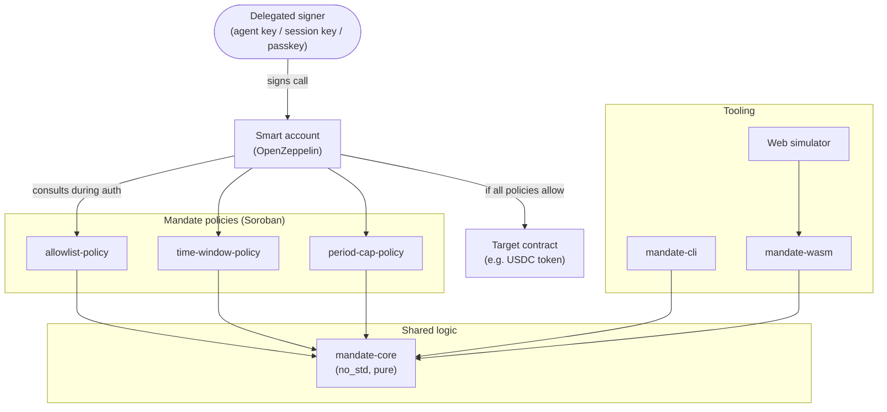
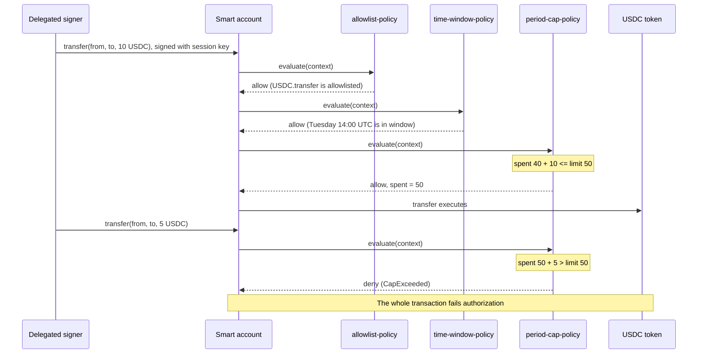

# Mandate
Reusable spending-policy contracts for Soroban smart accounts. 


 [](LICENSE) [](https://www.rust-lang.org/) [](https://www.rust-lang.org/) [](SECURITY.md)

Reusable spending-policy contracts for Soroban smart accounts. Give agents and apps a budget, not your keys.

## Overview

Smart accounts on Stellar can delegate signing power to other keys: a passkey on a second device, a session key held by a dApp, or a key held by an AI agent that pays for APIs through x402. Delegation is only safe if the account can limit what each delegated key is allowed to do. On Soroban smart accounts, those limits are enforced by **policies**: separate contracts the account consults during authorization, which can allow or deny each call.

Mandate is a library of small, composable, well-tested policy contracts, plus the tooling to use them safely:

- **Policy contracts** that restrict which contracts a key may call, when it may act, and how much it may spend per period.
- **A CLI** that validates policy configurations, evaluates sample calls offline, and prints the exact deployment commands.
- **A browser simulator** that replays a sequence of calls against a policy set and shows every allow or deny decision, with reasons, before anything is deployed.

**Who it is for:**

- **Wallet developers** adding delegated keys, session keys, or agent keys to passkey smart wallets.
- **Agent and x402 builders** who need on-chain, non-bypassable budgets for autonomous payments.
- **dApp developers** who want users to grant narrow, time-limited permissions instead of full signing power.

**Design principles:**

- **One source of truth.** All decision logic lives in `mandate-core`, a pure `no_std` crate. The on-chain contracts and the simulator run the same code, so they cannot disagree.
- **Deny by default.** Anything a policy does not explicitly allow is denied, and arithmetic overflow results in a denial, never a panic.
- **Small and auditable.** Each policy does one thing and can be reviewed in isolation.
- **Compose, don't duplicate.** Mandate targets the policy interface of OpenZeppelin's Stellar smart accounts, and works alongside the policies OpenZeppelin already ships.

### System Architecture



### Authorization Flow



## Policies

| Policy | Contract | What it enforces | State |
|---|---|---|---|
| Allowlist | `contracts/allowlist-policy` | The signer may only call approved contracts, and optionally only approved functions on them | Configuration only |
| Time window | `contracts/time-window-policy` | Calls are allowed only on configured UTC weekdays and within configured hour ranges | Configuration only |
| Period cap | `contracts/period-cap-policy` | A maximum amount of one token that may be transferred per period | Current period start and amount spent |

Policies are independent. Install any one of them, or combine all three on the same signer.

## Architecture

### mandate-core

A `no_std` Rust crate with no dependency on `soroban-sdk`. It defines plain types and one pure evaluation function per rule:

```rust
pub struct Call<'a> {
    pub contract: [u8; 32],
    pub function: &'a str,
    pub amount: Option<i128>,
    pub timestamp: u64,
}

pub enum Decision {
    Allow,
    Deny(Reason),
}

// Each rule: evaluate(&config, &state, &call) -> (Decision, NewState)
```

The Soroban contracts convert the authorization context into a `Call` and delegate the decision to core. `mandate-wasm` exposes the same functions to JavaScript, and `mandate-cli` calls them directly.

### allowlist-policy

Holds up to 20 entries, each a contract address with an optional list of function names. A call is allowed only if its contract is listed and, when functions are listed for that entry, its function is one of them. Contract-creation contexts are always denied.

### time-window-policy

Holds a 7-bit weekday mask (Monday is bit 0) and up to four UTC hour ranges, each `[start, end)`. Calls are evaluated against the ledger timestamp. Configurations with an empty day mask or an hour outside 0–24 are rejected when installed.

### period-cap-policy

Holds a token contract address, a limit, and a period length in seconds. For each smart account and token it stores `(period_start, spent)` in persistent storage. When the current ledger time passes `period_start + period_secs`, the counter resets. The policy reads the amount from `transfer(from, to, amount)` calls on the configured token; any other function on that token is denied unless the allowlist policy explicitly permits it. The TTL of the state entry is extended whenever it is written.

### Configuration and access model

Each policy's configuration is set when it is installed on a smart account and can only be changed by that account (`require_auth` on the account address). Policies expose read-only getters so wallets and dashboards can display the current limits.

| Contract | Read-only functions |
|---|---|
| `allowlist-policy` | `get_config(account)` |
| `time-window-policy` | `get_config(account)` |
| `period-cap-policy` | `get_config(account)`, `get_state(account)`, `remaining(account)` |

### Errors and events

Every policy defines a `#[contracterror]` enum. Denial reasons include `NotAllowlisted`, `OutsideTimeWindow`, `CapExceeded`, `InvalidConfig`, and `Overflow`. Policies emit events when they are installed, reconfigured, and when they deny a call, so indexers and wallets can show users why a transaction was rejected.

## Repository Layout

```
crates/mandate-core        policy evaluation logic (no_std, pure)
crates/mandate-wasm        wasm-bindgen wrapper used by the simulator
crates/mandate-cli         validate, check, and deploy-plan commands
contracts/allowlist-policy
contracts/time-window-policy
contracts/period-cap-policy
apps/simulator             static web simulator (Vite + React)
examples/                  sample configs and call fixtures
scripts/deploy-testnet.sh  build, optimize, and deploy all policies
deployments/testnet.json   deployed contract IDs
docs/                      architecture, integration guide, decisions
```

## Getting Started

### Prerequisites

| Tool | Install |
|---|---|
| Rust (stable) | `curl --proto '=https' --tlsv1.2 -sSf https://sh.rustup.rs \| sh` |
| Wasm target | `rustup target add wasm32v1-none` |
| Stellar CLI | `cargo install --locked stellar-cli` |
| wasm-pack (simulator only) | `cargo install wasm-pack` |
| Node.js LTS and pnpm (simulator only) | [nodejs.org](https://nodejs.org/), then `corepack enable` |

### Manual Setup

```bash
git clone https://github.com/<org>/mandate.git
cd mandate
```

### Build

Build all policy contracts:

```bash
stellar contract build
```

The Wasm files are written to:

```
target/wasm32v1-none/release/allowlist_policy.wasm
target/wasm32v1-none/release/time_window_policy.wasm
target/wasm32v1-none/release/period_cap_policy.wasm
```

Build the CLI:

```bash
cargo build --release -p mandate-cli
```

### Test

Run all unit, property, contract, and parity tests:

```bash
cargo test --workspace
```

The test suite includes an integration test that installs all three policies on an OpenZeppelin smart account in the Soroban test environment, and a parity test that asserts the contracts and `mandate-core` reach identical decisions for the same fixture calls.

### Run the Simulator Locally

```bash
cd apps/simulator
pnpm install
pnpm wasm      # builds mandate-wasm with wasm-pack
pnpm dev
```

The simulator is available at <http://localhost:5173>.

## Deployment

### Deploy to Testnet

Create and fund a deployer identity, then run the deployment script:

```bash
stellar keys generate deployer --network testnet --fund
./scripts/deploy-testnet.sh deployer
```

The script builds and optimizes each contract, deploys it, and writes the contract IDs to `deployments/testnet.json`.

To deploy a single policy manually:

```bash
stellar contract deploy \
  --wasm target/wasm32v1-none/release/period_cap_policy.wasm \
  --network testnet --source deployer
```

### Deploy the Simulator

The simulator is a static site. A GitHub Actions workflow publishes it on every merge to `main`. To host it elsewhere, run `pnpm build` in `apps/simulator` and serve the `dist/` folder from GitHub Pages, Vercel, or Cloudflare Pages.

### Releases

Tagging a version (`v*`) builds the Wasm artifacts, publishes them with their SHA-256 hashes in a GitHub Release, and attaches the CLI binaries. Always verify a Wasm hash before installing a policy on a real account.

## Example Usage

### Write a policy configuration

`examples/agent-budget.toml` limits an agent to paying USDC on weekdays during working hours, up to 50 USDC per day:

```toml
[allowlist]
contracts = [{ id = "C...USDC_SAC", functions = ["transfer"] }]

[time_window]
days = ["mon", "tue", "wed", "thu", "fri"]
utc_hours = [[8, 20]]

[period_cap]
token = "C...USDC_SAC"
limit = "50.0000000"
period_secs = 86400
```

### Validate it

```bash
mandate validate examples/agent-budget.toml
```

```
✔ allowlist    1 contract, 1 function
✔ time_window  Mon–Fri, 08:00–20:00 UTC
✔ period_cap   50.0000000 per 86400s
```

### Evaluate sample calls offline

```bash
mandate check examples/agent-budget.toml examples/calls.json
```

```
#  time (UTC)         call                 amount  decision  reason
1  Tue 09:12          USDC.transfer        20.00   ALLOW
2  Tue 13:40          USDC.transfer        25.00   ALLOW
3  Tue 16:05          USDC.transfer        10.00   DENY      CapExceeded (45/50 spent)
4  Sat 10:00          USDC.transfer         1.00   DENY      OutsideTimeWindow
5  Wed 09:00          DEX.swap              5.00   DENY      NotAllowlisted
```

### Generate deployment commands

```bash
mandate deploy-plan examples/agent-budget.toml --network testnet
```

This prints the exact `stellar contract deploy` and `stellar contract invoke` commands needed to deploy the policies and install them on your smart account. The CLI never executes commands or handles keys itself.

### Read a policy's state on-chain

```bash
stellar contract invoke --id <PERIOD_CAP_ID> --network testnet --source deployer \
  -- remaining --account <SMART_ACCOUNT_ADDRESS>
```

## Troubleshooting

**`stellar contract build` fails because the target is not installed.**

```bash
rustup target add wasm32v1-none
```

**`stellar contract deploy` fails with "account not found".**
Fund the source identity on testnet with `stellar keys fund deployer --network testnet`, or create it with `--fund` as shown above.

**A call is denied with `NotAllowlisted`, but the contract is on the list.**
Check whether the entry also lists functions. If it does, the function being called must be one of them. Also confirm you allowlisted the token's contract address (for example, the Stellar Asset Contract for USDC), not the asset's issuer account.

**The period-cap counter reset unexpectedly.**
Either the period elapsed, or the state entry expired and was archived. The policy extends its TTL on every write, but an account that is idle for a very long time can still lose its state. Report it if neither explains what you saw.

**The simulator and the chain disagree about a decision.**
This should be impossible, because both run `mandate-core`. Please open an issue with the configuration and calls, and we will add them to the parity test suite.

## FAQ

**Is Mandate a wallet or a smart account?**
No. Mandate provides policies that plug into an existing smart account, such as OpenZeppelin's Stellar smart accounts.

**Do I need all three policies?**
No. Each policy is independent. Most agent-payment setups combine the allowlist and the period cap; the time window is optional.

**Can an agent bypass a policy?**
Not through the policies' own logic: they are enforced by the smart account during authorization, on-chain, so the agent's code has no say. Mandate is unaudited, however, so treat it as testnet-only until an audit is complete.

**Why does the period cap only track one token?**
To keep each policy small and auditable. Install one period-cap policy per token you want to limit. Multi-token caps are on the roadmap.

**Does it work on mainnet?**
The contracts are network-agnostic, but they are unaudited. Do not use them to protect real funds until an audit has been completed and published.

## Contributing

New policies are the easiest way to contribute, because each one is self-contained.

1. Read [CONTRIBUTING.md](CONTRIBUTING.md), including its "Adding a new policy" checklist.
2. Pick an issue from the tracker or from [ROADMAP.md](ROADMAP.md). Issues labelled `good first issue` are a good starting point.
3. Make sure `cargo fmt --check`, `cargo clippy -- -D warnings`, and `cargo test --workspace` pass before opening a pull request.

Planned work includes a recipient allowlist, a per-transaction cap, expiring session-key policies, multi-token caps, recovery co-signer delays, and an end-to-end x402 example.

## Security

Mandate is **unaudited**. Use it on testnet only. To report a vulnerability, follow [SECURITY.md](SECURITY.md). Please do not open a public issue.

## License

[Apache-2.0](LICENSE)
